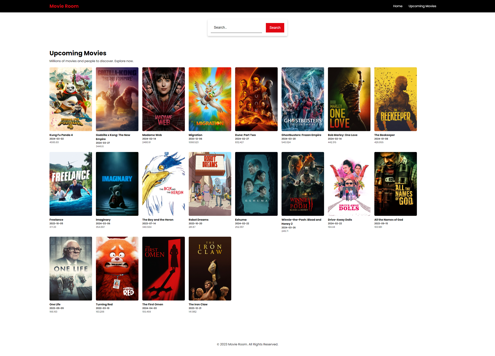

# Movie Room
Submission: Membuat Aplikasi Web dengan ES6, Custom Element, NPM, Webpack, dan AJAX pada kelas Belajar Fundamental Front-End Web Development

## Run Locally
Clone the project
```bash
  git clone https://github.com/takasicode/movie-room.git
```

Go to the project directory
```bash
  cd movie-room
```

Install dependencies
```bash
  npm install
```

Start the server
```bash
  npm run dev
```

## Rating Submission
⭐⭐⭐⭐

## Screenshot


## Tech Stack
[](https://github.com/takasicode/movie-room)
 